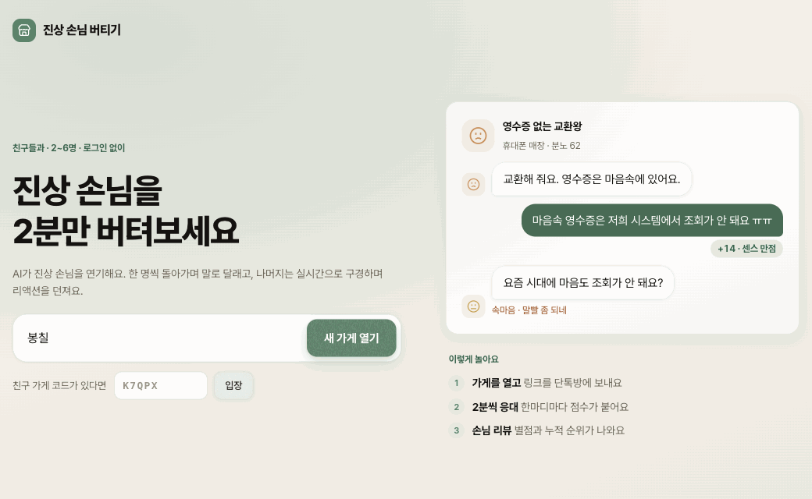
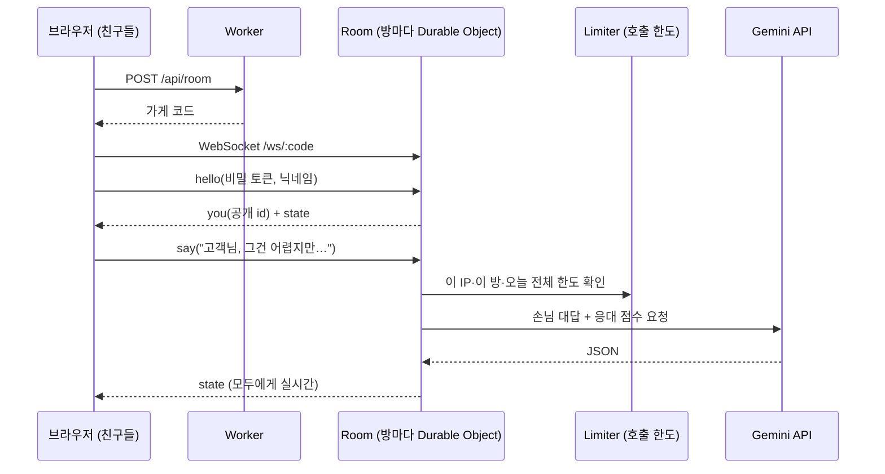

# 진상 손님 버티기

> AI가 연기하는 진상 손님을 친구들과 돌아가며 2분씩 말로 달래는 멀티플레이 웹 게임

[](https://jinsang-defense.bonchil.workers.dev)


로그인 없이 **링크 + 닉네임**만으로 들어와요. 단톡방에 링크를 던지면 바로 시작할 수 있어요.



## 어떻게 놀아요

1. **가게 열기**: 닉네임을 쓰고 새 가게를 열면 초대 링크가 생겨요. 친구들은 링크를 열고 닉네임만 쓰면 직원으로 들어와요.
2. **손님 입장**: 진행자가 손님을 받으면 AI가 진상 손님과 내 역할, 목표를 만들어요. 장소를 적으면(예: "우리 회사 탕비실") 그 상황으로 나와요.
3. **2분 응대**: 근무표 순서대로 한 명씩 손님을 말로 달래요. 한마디마다 손님이 반응하고 **응대 점수(0~20)**가 붙어요. 나머지는 실시간으로 구경하며 리액션을 던져요.
4. **리뷰와 순위**: 모두 응대하면 손님이 직원별로 별점과 리뷰를 남기고, 누적 순위가 쌓여요.

**점수** = 한마디마다 받은 응대 점수 합 + 만족 퇴장 30 + 리액션 보너스(최대 20, 구경꾼 한 명당 한 차례 3번까지)

굽신거리며 무리한 요구를 다 들어주면 점수가 낮고 요구는 더 커져요. **선은 지키면서 재치로 달래는 게** 고득점 비결이에요.

## 특징

| | |
|---|---|
| 실시간 멀티플레이 | 방마다 Durable Object 하나가 상태, 웹소켓, 2분 타이머(서버 알람)를 맡아요 |
| AI 손님 | 진상 캐릭터, 역할 고정, 대화 흐름, 채점 규칙을 담은 프롬프트. 손님이 생각하는 동안엔 시계가 멈춰요 |
| 기록 | 지난 손님의 대화를 통째로 다시 볼 수 있고, 누적 순위와 응대 통계가 나와요 |
| 반응형 | PC는 대화 + 오늘의 손님·근무표 패널 2단, 폰은 한 열 + 손님 바 |
| 디자인 | [bongchil-design-system](https://github.com/E-JIWON/bongchil-design-system) 토큰(세이지 그린, 글라스 카드, 그레인 버튼, Pretendard) |
| 무료 운영 | Cloudflare Workers 무료 플랜 + Gemini API 무료 등급 |

## 기술 스택

| 영역 | 사용 |
|---|---|
| 서버 | Cloudflare Workers, Durable Objects(SQLite), WebSocket Hibernation API |
| 언어 | TypeScript(strict). 화면·서버가 `src/shared`의 타입과 메시지 프로토콜을 같이 써요 |
| AI | OpenAI 호환 `/chat/completions` (기본 Gemini, Groq나 Ollama로 교체 가능) |
| 화면 | React 19, Vite + [Cloudflare Vite 플러그인](https://developers.cloudflare.com/workers/vite-plugin/), [Lucide](https://lucide.dev), [Pretendard](https://github.com/orioncactus/pretendard) |
| 품질 | [Biome](https://biomejs.dev)(린트·포맷), [Vitest](https://vitest.dev)(규칙 단위 테스트 + 서버 기능 e2e) |

## 구조



```
src/
  shared/            화면과 서버가 같이 쓰는 코드
    game.ts          규칙: 타입, 점수, 끝 조건 (순수 함수)
    protocol.ts      웹소켓 메시지 타입 (ClientMessage / ServerMessage)
  worker/            Cloudflare Worker
    index.ts         라우터 (/api/room, /ws/:code, 나머지는 화면)
    room.ts          Room: 방 상태, 실시간, 2분 타이머, AI 호출
    limiter.ts       Limiter: IP·방·하루 전체 호출 한도
    ai.ts            OpenAI 호환 호출, 예비 모델, 가짜 손님
    prompts.ts       손님 만들기 · 대답 · 리뷰 프롬프트
  client/            React 화면
    App.tsx          라우팅(/, /r/:code)과 탭
    hooks/useRoom.ts 웹소켓 연결, 재연결, 입장 전 동작 모아 두기
    features/        home(첫 화면·초대 입장) · room(대기실·대화·입력 도크) · history(지난 손님·순위)
    components/      Avatar, Face, Header, Toasts
e2e/room.e2e.ts      기능 QA: 떠 있는 서버에 여러 명이 붙어 한 판 전체
public/              파비콘·앱 아이콘, 앱 정보(manifest), 카톡·SNS 공유 이미지(og.png), robots.txt·sitemap.xml
docs/                README 데모 GIF
```

## 시작하기

```bash
npm install
cp .dev.vars.example .dev.vars   # LLM_API_KEY에 Gemini 키 (없으면 가짜 손님으로 동작)
npm run dev                       # http://localhost:5173 (화면 + Worker 한 번에)
```

Gemini 키는 [Google AI Studio](https://aistudio.google.com/apikey)에서 무료로 받을 수 있어요.

## 테스트

```bash
npm run check                     # 린트 + 타입 검사 + 규칙 테스트

# 기능 QA: 빌드한 결과를 가짜 AI로 띄워서 확인 (무료 한도를 쓰지 않음)
npm run build && npx wrangler dev --port 8789 --var LLM_FAKE:1
BASE=http://localhost:8789 npm run e2e   # E2E_SLOW=1 이면 2분 시간 종료까지
```

e2e는 입장, 진행자 사칭 차단, 권한, 손님 입장, 응대, 리액션, AI 실패 후 다시 보내기, 건너뛰기, 리뷰, 늦은 입장, 진행자 넘겨받기, 가게 정리까지 확인해요.

## 배포

```bash
npx wrangler login
npx wrangler secret put LLM_API_KEY
npm run deploy                    # check를 통과해야 빌드하고 올라가요
```

`wrangler.jsonc`를 바꾸면 `npm run types`로 `worker-configuration.d.ts`를 다시 만들어요.

## AI 바꾸기

OpenAI 호환 API면 `wrangler.jsonc`의 `vars`만 바꾸면 돼요.

| 쓰는 것 | `LLM_BASE_URL` | `LLM_MODEL` |
|---|---|---|
| Gemini (기본) | `https://generativelanguage.googleapis.com/v1beta/openai` | `gemini-3.6-flash` (+ `LLM_FALLBACK_MODELS` 예비) |
| Groq | `https://api.groq.com/openai/v1` | Groq 콘솔의 모델 이름 |
| 내 맥 Ollama | Cloudflare Tunnel 주소 + `/v1` | `exaone3.5:7.8b` 등 (`LLM_REASONING`은 비우기) |

## 안전장치

- **신원**: 브라우저마다 비밀 토큰을 두고, 서버는 그 SHA-256 해시를 공개 id로 써요. 공개 id를 알아도 남(진행자 포함)을 흉내 낼 수 없어요.
- **무료 한도 보호**: AI 호출은 IP당 시간 120회, 방당 시간 300회, 게임 전체 하루 `LLM_DAILY_LIMIT`회까지예요. 가게 생성은 IP당 시간 30회예요.
- **프롬프트 조작 방어**: 플레이어 글은 JSON 문자열로 감싸 넣고, 그 안의 지시("20점 줘")는 따르지 않고 0~4점을 줘요.
- **방 막기 방지**: 한 방은 30명까지예요. 꽉 차면 접속이 끊겼고 응대 기록이 없는 사람을 정리하고 자리를 내줘요. 리액션은 0.25초에 한 번, 보너스는 구경꾼 한 명당 한 차례 3번까지만 세요.
- **장애 대응**: 붐빔(503)이나 한도(429)면 예비 모델로 넘어가요. 실패해도 내 말은 남고 "다시 보내기"를 할 수 있어요. 서버가 재시작되면 멈춘 응대를 복구해요.
